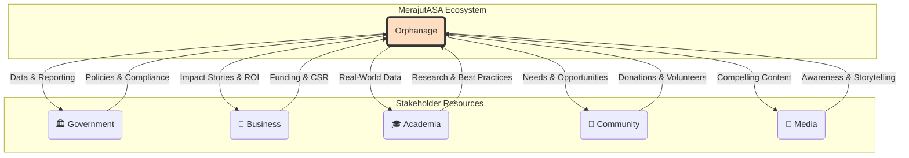

# 1. The Orphanage-Centric Model

> **Purpose**: To formally define the "soul of the project." This document details our core philosophy that MerajutASA.id is a platform built *for* orphanages, empowering them to collaborate *with* the five key stakeholders.

---

## 1.1. Defining the Orphanage-Centric Model

The most critical distinction to make about the MerajutASA platform is that it is **not** a neutral meeting place for five equal stakeholders. It is a dedicated platform built with a clear and unwavering focus: **the empowerment of the orphanage.**

Our model reframes the traditional stakeholder ecosystem. Instead of placing all five stakeholders in a circle, we place the orphanage at the center. The platform provides the tools for the orphanage to effectively leverage the resources, expertise, and support of the other stakeholders.

This orphanage-centric model dictates that the primary user and beneficiary of the platform's features is the orphanage administration and, by extension, the children in their care.

## 1.2. Rationale: Why This Model is Essential

Adopting an orphanage-centric model is a strategic choice rooted in the belief that sustainable, long-term change comes from empowering those closest to the problem.

*   **Prioritizes Child Welfare**: By empowering the primary caregivers (the orphanages), we ensure that the platform's development is always aligned with the most pressing needs of the children.
*   **Fosters Agency, Not Dependency**: This model is designed to give orphanages agency. They are not passive recipients of aid but active participants in their own development, using the platform to articulate their needs, showcase their work, and build relationships.
*   **Increases Stakeholder Impact**: For the other four stakeholders, this model provides a clearer and more effective path to creating impact. A business knows their CSR funds are addressing a need directly stated by an orphanage. A volunteer knows their skills are being matched to a real, validated opportunity. This direct line of sight from resource to need is a core value proposition.

## 1.3. Core Principles of the Orphanage-Centric Platform

This philosophy translates into three core principles that must guide all product development, design, and partnership decisions.

### Principle 1: Empowerment
**"Provide tools that increase an orphanage's capacity and autonomy."**

Features should be designed to give orphanage staff capabilities they did not have before. The platform should automate, simplify, or enable tasks that allow them to be more effective managers, caregivers, and community leaders.

### Principle 2: Amplification
**"Act as a megaphone for the orphanage's voice."**

The platform should amplify the stories, needs, and successes of the orphanages to a wider audience. It should provide the tools for them to build their own brand, communicate their impact, and advocate for their children.

### Principle 3: Simplification
**"Reduce the administrative burden on caregivers."**

Orphanage staff are often overworked and under-resourced. The platform must be a tool that saves them time, not one that creates more work. Every feature should be evaluated on its ability to simplify complex tasks like compliance reporting, financial tracking, or volunteer management.

## 1.4. Manifestation in Platform Features

This philosophy is not just abstract; it is made concrete through the platform's features.

| Feature Area | Manifestation of the Orphanage-Centric Model | Guiding Principle(s) |
| :--- | :--- | :--- |
| **Orphanage Profile & Needs Management** | Orphanages have full control to define their own identity, showcase their programs, and articulate their specific, real-time needs (e.g., for funding, supplies, or volunteers). | Empowerment, Amplification |
| **Fundraising Campaign Tools** | Instead of waiting for donations, orphanages can proactively create and manage their own fundraising campaigns for specific projects (e.g., a new library, school uniforms). | Empowerment |
| **Direct Content Publishing** | Orphanages can publish their own success stories, news, and updates, creating a direct, unfiltered communication channel with the community, donors, and media. | Amplification |
| **Volunteer Opportunity Management** | Orphanages define the volunteer roles they need, vet applicants, and manage schedules, ensuring that volunteer efforts are aligned with their actual needs. | Empowerment, Simplification |
| **Automated Compliance Reporting** | The platform provides tools to automatically generate the reports required by government agencies, dramatically reducing the time spent on administrative paperwork. | Simplification |
| **Transparent Donation Dashboards** | Orphanages can show donors exactly how their contributions have been used, building trust and encouraging recurring support. | Amplification, Empowerment |

## 1.5. Implications for Other Stakeholders

The orphanage-centric model defines a clear role for every other stakeholder: to be a responsive and effective partner to the orphanages.

*   **For Government**: Your role is to use the clear, structured data from orphanages to create more effective policies and provide targeted support.
*   **For Businesses**: Your role is to respond to the real-world needs articulated by the orphanages, making your CSR investments more targeted and impactful.
*   **For Academia**: Your role is to use the rich, ground-level data to conduct research that provides actionable insights back to the orphanages, helping them improve their practices.
*   **For Community & Media**: Your role is to listen to the stories and needs amplified by the orphanages and respond with your support, whether through donations, volunteering, or sharing their stories.

By adopting this model, we ensure that the entire MerajutASA ecosystem is oriented around a single, unified goal: creating the best possible environment for every child in every orphanage to thrive.
