# 1. The Orphanage-Centric Model

> **Purpose**: To formally define the "soul of the project." This document details our core philosophy that MerajutASA.id is a platform built *for* orphanages, empowering them to collaborate *with* the five key stakeholders.

---

## 1.1. Defining the Model: From Stakeholder Hub to Empowerment Engine

The most critical distinction of the MerajutASA platform is its core philosophy. It is **not** a neutral meeting place for five equal stakeholders. It is a dedicated platform built with a clear and unwavering focus: **the empowerment of the orphanage.**

This reframes the entire ecosystem. The platform is the engine, the orphanage is the driver, and the stakeholders are the high-octane fuel and support crew. The goal is to give orphanages the tools to effectively leverage the resources, expertise, and support of the Penta-Helix.

### The Value-Flow Diagram

This diagram illustrates the *exchange of value*, moving beyond a simple flow of resources.

```mermaid
graph TD
    subgraph MerajutASA Ecosystem
        O[("Orphanage <br/> *The Central Actor*")]
    end

    subgraph Stakeholder Partners
        G(🏛️ Government)
        B(🏢 Business)
        A(🎓 Academia)
        C(👥 Community)
        M(📰 Media)
    end

    G -- Policy & Compliance Framework --> O
    O -- Verifiable Compliance Data & Social Impact Metrics --> G

    B -- Strategic Funding & Skilled Volunteers --> O
    O -- Measurable SROI & Brand-Safe Impact Stories --> B

    A -- Actionable Best Practices & Program Evaluation --> O
    O -- Rich, Anonymized Longitudinal Data for Research --> A

    C -- Donations, Unskilled Volunteers & Local Support --> O
    O -- Trusted Opportunities & Transparent Impact Reporting --> C

    M -- Broad Public Awareness & Narrative Shaping --> O
    O -- Authentic, Vetted Human-Interest Content --> M

    style O fill:#FFDDC1,stroke:#333,stroke-width:4px
```

---

## 1.2. Theoretical Foundation: Community Empowerment Theory

Our model is not built in a vacuum. It is a practical application of **Community Empowerment Theory**, a well-established framework in social work and community development.

The World Health Organization defines empowerment as *"the process of enabling communities to increase control over their lives."* This is precisely our goal for the orphanages on our platform.

Empowerment theory focuses on addressing "direct power blocks"—the systemic barriers that prevent marginalized groups from achieving their goals. For many orphanages, these blocks include:
*   **Obscurity:** Lack of visibility to potential donors and volunteers.
*   **Resource Scarcity:** Inequitable access to funding and support.
*   **Administrative Burden:** The overwhelming weight of compliance and paperwork.
*   **Information Asymmetry:** Lack of access to best practices in child care and management.

The MerajutASA platform is explicitly designed to be a **power block dismantler**. Each of our core principles is a direct application of this theory.

---

## 1.3. Our Core Principles (The 3 A's)

This philosophy translates into three core principles that guide all product and partnership decisions.

### Principle 1: Agency (Empowerment)
**"Provide tools that increase an orphanage's capacity and autonomy."**

This is the heart of empowerment. We build features that give orphanage staff capabilities they did not have before, allowing them to move from being passive recipients of aid to active agents of their own success. This is about fostering self-efficacy and control.

### Principle 2: Amplification (Voice)
**"Act as a megaphone for the orphanage's voice."**

Empowerment requires influence. The platform must amplify the stories, needs, and successes of the orphanages to a wider audience. We provide the tools for them to build their own brand, communicate their impact, and advocate for their children and their needs.

### Principle 3: Alleviation (Simplification)
**"Reduce the administrative burden to free up human capital."**

Orphanage staff are often overworked and under-resourced. The platform must be a tool that saves them time, not one that creates more work. By alleviating the burden of complex tasks (like compliance reporting or financial tracking), we free up their most valuable resource—time—to be spent on direct child care.

---

## 1.4. Measuring Empowerment: From Ideals to Metrics

To ensure our model is more than just an ideal on paper, we must commit to measuring the empowerment we create. The following KPIs will be integrated into our analytics and reporting frameworks.

| Empowerment Dimension | Key Performance Indicator (KPI) | How We Measure It |
| :--- | :--- | :--- |
| **Financial Autonomy** | **Self-Initiated Funding Ratio:** % of an orphanage's donation income derived from campaigns they created and managed on the platform. | Track donation sources within the platform. |
| **Administrative Efficiency** | **Time-to-Compliance Reduction:** % decrease in time spent by staff on mandatory government reporting. | User surveys and workflow timing analytics. |
| **Community Influence** | **Voice-to-Engagement Score:** A composite score measuring the community engagement (shares, volunteer sign-ups) generated per story published by an orphanage. | Platform analytics tracking content performance. |
| **Network Growth** | **Partner-Sourced Inquiries:** Number of inbound partnership inquiries (from business, media, etc.) that an orphanage receives directly through their platform profile. | Tracking inquiry sources and platform referrals. |
| **Capacity Building** | **Best Practice Adoption Rate:** % of orphanages that adopt new childcare or management practices introduced through academic partner content on the platform. | User surveys and feature adoption tracking. |

---

## 1.5. Implications for Stakeholders

The orphanage-centric model defines a clear and compelling role for every stakeholder: to be a responsive and effective partner to the empowered orphanages.

*   **For Government**: Your role is to use the high-quality, structured data from orphanages to create more effective, evidence-based policies.
*   **For Businesses**: Your role is to act as a strategic investor, using the platform's transparency and analytics to channel your CSR funds to validated needs for maximum social return.
*   **For Academia**: Your role is to be a "critical friend," using the data to provide actionable insights that help orphanages continuously improve their practices.
*   **For Community & Media**: Your role is to be a responsive audience, listening to the amplified voices of the orphanages and channeling your support to where it is most needed and will be most effective.

By committing to this model, we ensure the entire MerajutASA ecosystem is oriented around a single, unified goal: creating the best possible environment for every child in every orphanage to thrive.
